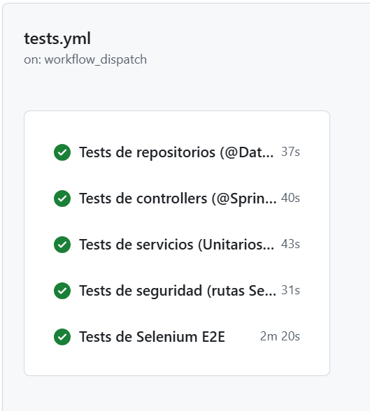
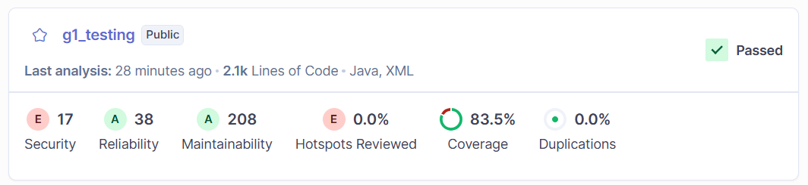
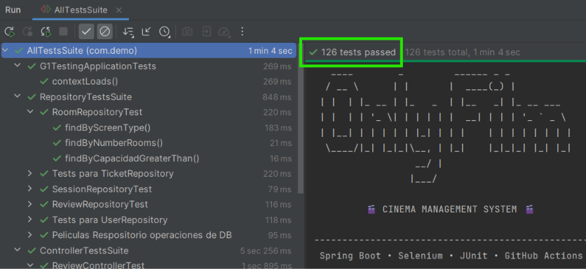
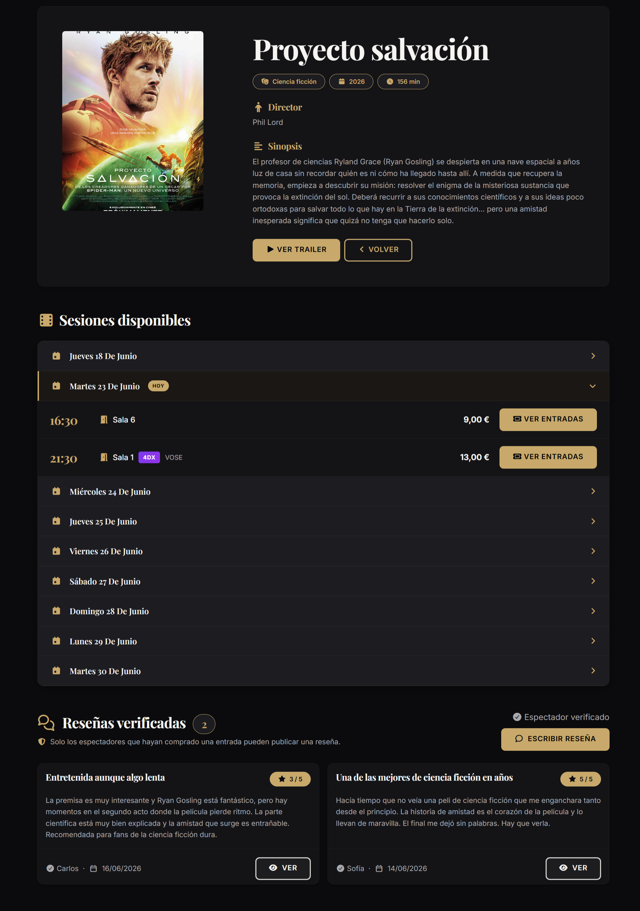
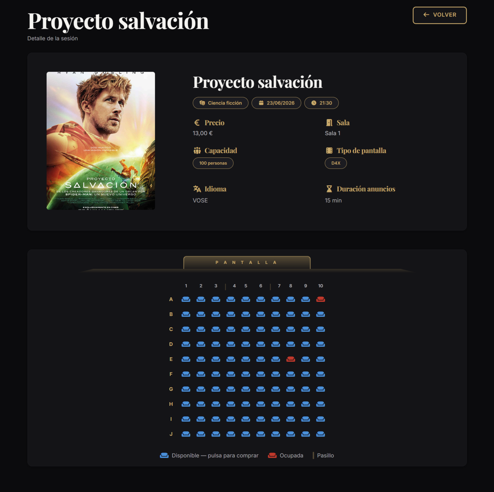
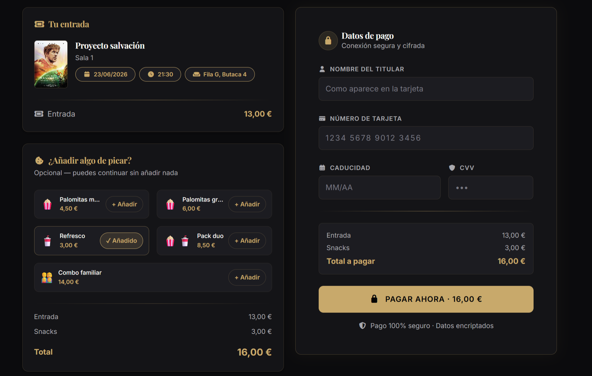
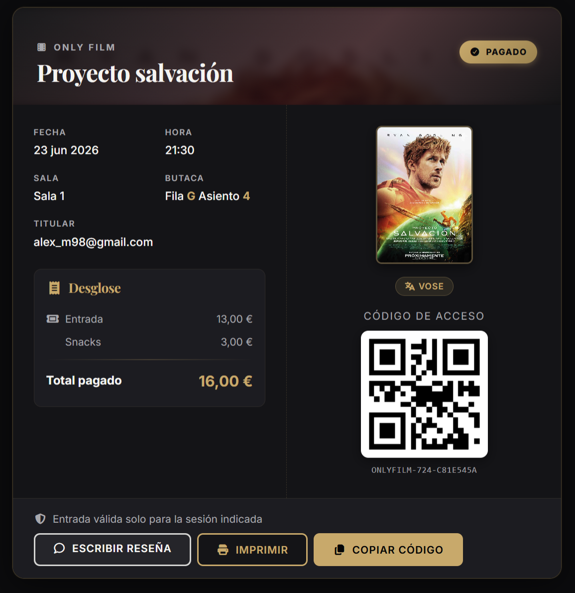
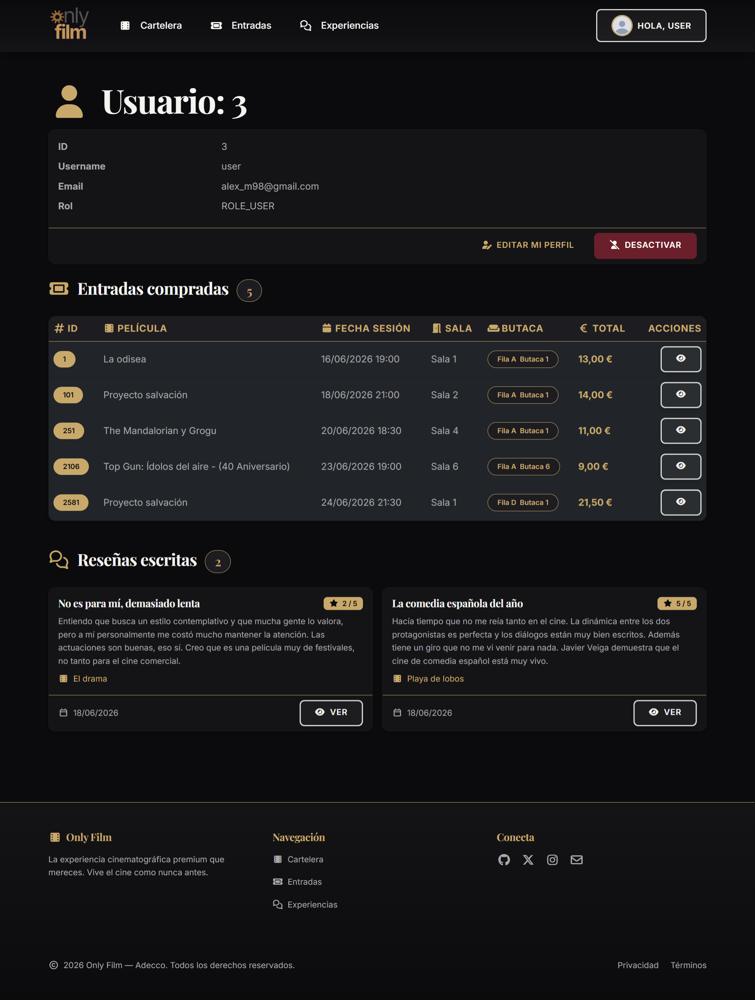
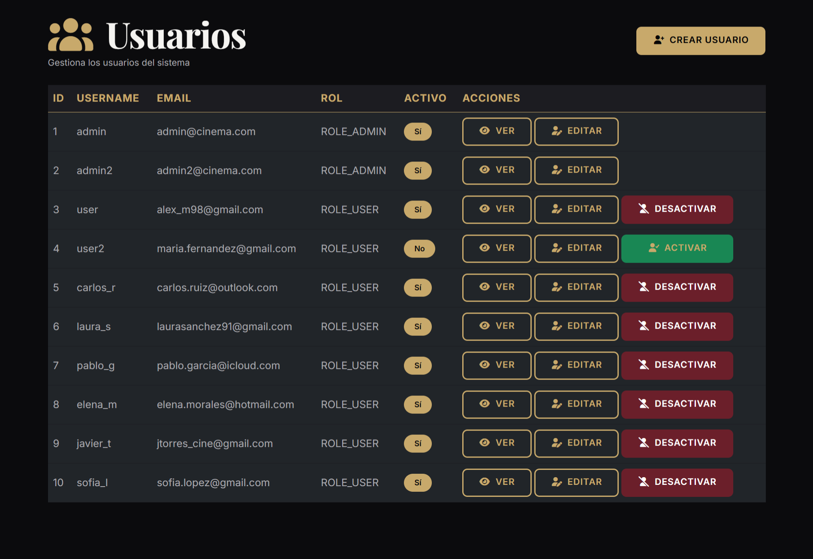

# 🎬 Only Film

> Plataforma de gestión cinematográfica desarrollada con **Spring Boot**, **Thymeleaf** y un fuerte enfoque en **calidad software**, **testing automatizado**, **integración continua** y **buenas prácticas de desarrollo**.

<p align="center">
  
  
  
  
  
  
  
  
  
</p>

---

# 📖 Descripción

**Only Film** es una aplicación web de gestión de cine desarrollada con Spring Boot y Thymeleaf que permite consultar películas, gestionar sesiones, comprar entradas, generar tickets QR y administrar la plataforma mediante distintos niveles de permisos.

El proyecto ha sido concebido como un ejercicio completo de ingeniería del software, poniendo especial atención en:

* Arquitectura MVC
* Calidad del código
* Testing automatizado
* Integración continua
* Seguridad
* Experiencia de usuario
* Buenas prácticas de desarrollo

---

# ✨ Funcionalidades principales

## 🎥 Visitantes

* Consulta de cartelera
* Visualización de detalles de películas
* Consulta de sesiones disponibles
* Registro e inicio de sesión

## 👤 Usuarios registrados

* Compra de entradas
* Selección de butacas
* Proceso de checkout
* Generación de tickets QR
* Historial de compras
* Valoración y reseñas de películas

## 🛠️ Administradores

* Gestión de películas
* Gestión de salas
* Gestión de sesiones
* Gestión de usuarios
* Activación y desactivación lógica de elementos
* Panel de administración

---

# 🏗️ Arquitectura

La aplicación sigue una arquitectura MVC multicapa:

```text
Controladores (MVC)
        │
Servicios
        │
Repositorios
        │
Base de Datos
```

Tecnologías principales:

```text
Spring MVC
Spring Security
Spring Data JPA
Hibernate
Thymeleaf
Bootstrap
H2 Database
```

---

# 🗄️ Modelo de datos

| Entidad | Descripción               |
| ------- | ------------------------- |
| Movie   | Películas disponibles     |
| Room    | Salas de cine             |
| Session | Sesiones de proyección    |
| Ticket  | Entradas adquiridas       |
| Review  | Reseñas y valoraciones    |
| User    | Usuarios de la aplicación |

---

# 🔐 Seguridad

La aplicación implementa autenticación y autorización mediante Spring Security.

## Roles disponibles

| Rol        | Descripción        |
| ---------- | ------------------ |
| ROLE_USER  | Usuario registrado |
| ROLE_ADMIN | Administrador      |

## Operaciones protegidas

* Compra de entradas
* Acceso a tickets QR
* Gestión de películas
* Gestión de salas
* Gestión de sesiones
* Gestión de usuarios
* Panel administrativo

---

# 🧠 Detalles técnicos destacables

* Arquitectura MVC desacoplada mediante:

  * Controller
  * Service
  * Repository

* Testing multinivel:

  * Repository Tests
  * Service Tests
  * Controller Tests
  * Security Tests
  * Selenium E2E Tests

* Seguridad basada en Spring Security con control de acceso por roles:

  * ROLE_USER
  * ROLE_ADMIN

* Generación dinámica de tickets QR.

* Gestión de estados de tickets:

  * LIBRE
  * PAGADO
  * CANCELADO

* Borrado lógico mediante atributo `active`.

* Integración continua mediante GitHub Actions.

* Análisis estático y métricas de calidad mediante SonarQube.

* Cobertura de código superior al 83%.

* Despliegue contenerizado mediante Docker.

* Base de datos H2 persistente para despliegue y H2 en memoria para testing.

---

# 🧪 Estrategia de Testing

Uno de los objetivos principales del proyecto ha sido implementar una estrategia de testing completa que cubra todas las capas de la aplicación.

## Pirámide de Testing

```text
           Selenium E2E
        Controller Tests
          Service Tests
        Repository Tests
```

## Tipos de pruebas implementadas

| Tipo de prueba     | Objetivo                                      |
| ------------------ | --------------------------------------------- |
| Repository Tests   | Validación de consultas y persistencia        |
| Service Tests      | Validación de lógica de negocio               |
| Controller Tests   | Verificación de endpoints MVC                 |
| Security Tests     | Validación de permisos y seguridad            |
| Selenium E2E Tests | Automatización de flujos completos de usuario |

## Resultado final

```text
126 / 126 Tests Superados
100 % Éxito
```

La suite completa ejecuta pruebas de backend, seguridad y experiencia de usuario de forma automatizada.

---

# 🤖 Pruebas End-to-End con Selenium

Las pruebas E2E reproducen el comportamiento real de los usuarios validando:

* Inicio de sesión
* Navegación por la aplicación
* Consulta de películas
* Selección de sesiones
* Selección de butacas
* Checkout
* Generación de tickets QR
* Creación de reseñas

Estas pruebas garantizan la estabilidad funcional del sistema desde la perspectiva del usuario final.

---

# ⚙️ Integración Continua (CI/CD)

El proyecto incorpora integración continua mediante GitHub Actions.

## Pipelines automatizados

* Tests de repositorios
* Tests de servicios
* Tests de controladores
* Tests de seguridad
* Tests Selenium E2E

## Beneficios

* Detección temprana de errores
* Prevención de regresiones
* Validación automática de cambios
* Aumento de la calidad global del proyecto

> Los workflows se ejecutan mediante `workflow_dispatch` para optimizar el consumo de minutos disponibles en el entorno académico compartido.

---

# 📊 Calidad del Código

La calidad del proyecto es analizada mediante SonarQube.

## Métricas actuales

| Métrica         | Valor  |
| --------------- | ------ |
| Cobertura       | 83.5 % |
| Maintainability | A      |
| Reliability     | A      |
| Duplicaciones   | 0 %    |

El análisis continuo permite detectar:

* Código duplicado
* Deuda técnica
* Posibles defectos
* Problemas de mantenibilidad
* Hotspots de seguridad

---

# 🔒 Permisos por rol

| Acción                             | Visitante | Usuario | Administrador |
| ---------------------------------- | :-------: | :-----: | :-----------: |
| Ver películas y sesiones           |     ✅     |    ✅    |       ✅       |
| Registrarse                        |     ✅     |    ❌    |       ❌       |
| Iniciar sesión                     |     ✅     |    ❌    |       ❌       |
| Comprar entradas                   |     ❌     |    ✅    |       ✅       |
| Acceder a tickets QR               |     ❌     |    ✅    |       ✅       |
| Crear reseñas                      |     ❌     |    ✅    |       ✅       |
| Gestionar películas                |     ❌     |    ❌    |       ✅       |
| Gestionar salas                    |     ❌     |    ❌    |       ✅       |
| Gestionar sesiones                 |     ❌     |    ❌    |       ✅       |
| Gestionar usuarios                 |     ❌     |    ❌    |       ✅       |
| Acceder al panel de administración |     ❌     |    ❌    |       ✅       |

---

# 🚀 Despliegue

La aplicación ha sido desplegada satisfactoriamente en una VPS Linux utilizando Docker.

## Stack de despliegue

```text
Ubuntu Linux
Docker
Docker Compose
Spring Boot
H2 Persistente
```

## Características

* Aplicación contenerizada
* Persistencia de datos
* Ejecución en entorno cloud
* Configuración mediante perfiles Spring
* Despliegue reproducible

---

# 🛠️ Stack tecnológico

## Backend

* Java 25
* Spring Boot 4
* Spring MVC
* Spring Data JPA
* Hibernate

## Frontend

* Thymeleaf
* Bootstrap 5
* HTML5
* CSS3
* JavaScript

## Base de datos

* H2 Database

## Testing

* JUnit 5
* Mockito
* MockMvc
* Selenium WebDriver

## DevOps

* Git
* GitHub
* GitHub Actions
* Docker
* SonarQube

---

# ▶️ Instalación local

## Requisitos

* Java 25
* Maven
* Git

## Clonar repositorio

```bash
git clone https://github.com/certidevs/g1_testing.git
cd g1_testing
```

## Ejecutar aplicación

```bash
mvn spring-boot:run
```

Acceso:

```text
http://localhost:8080
```

---

# 🧪 Ejecución de pruebas

## Ejecutar todos los tests

```bash
mvn test
```

## Ejecutar la suite completa

```bash
mvn test -Dtest=AllTestsSuite
```

## Ejecutar únicamente Selenium E2E

```bash
mvn test -Dtest=SeleniumTestsSuite
```

## Ejecutar únicamente Repository Tests

```bash
mvn test -Dtest=RepositoryTestsSuite
```

## Ejecutar únicamente Controller Tests

```bash
mvn test -Dtest=ControllerTestsSuite
```

La suite completa ejecuta actualmente:

```text
126 / 126 tests superados
```
---

# 🔑 Usuarios de demostración

| Usuario | Contraseña | Rol           |
| ------- | ---------- | ------------- |
| admin   | admin      | Administrador |
| user    | user       | Usuario       |

---

# 🗂️ Estructura del proyecto

```text
src/main/java/com/demo
├── config
├── controller
├── dto
├── model
├── repository
├── service

src/test/java/com/demo
├── controller
├── repository
├── service
├── security
└── ui
```

---

# 📸 Calidad y Automatización

## GitHub Actions



## SonarQube



## Suite completa de pruebas



---

# 📸 Funcionalidades

## 🎬 Cartelera


## 🎥 Detalle de película



## 🎟️ Selección de butacas



## 💳 Checkout



## 🎟️ Ticket QR



## 👤 Perfil de usuario



## 🛠️ Gestión de usuarios (Admin)



---

# 👥 Equipo de desarrollo

| Integrante | GitHub                               |
|------------|--------------------------------------|
| Fran Ramírez Martín | https://github.com/fran-eliot        |
| Adrián López de Haro | https://github.com/alopezdeharo      |
| Barbara Urbano | https://github.com/barbieurbano      |
| Andrés Soto | https://github.com/mrandressoto-code |

---

# 🔮 Mejoras futuras

* API REST
* Autenticación JWT
* PostgreSQL / MySQL
* Integración con pasarela de pago
* Aplicación móvil
* Observabilidad y monitorización
* Kubernetes
* Despliegue multi-entorno

---

# 🔗 Repositorio

https://github.com/certidevs/g1_testing

---

# 📄 Licencia

Proyecto académico desarrollado con fines educativos.

---

<p align="center">
Desarrollado con ☕ Java, 🍃 Spring Boot y ❤️ pasión por la calidad software
</p>

